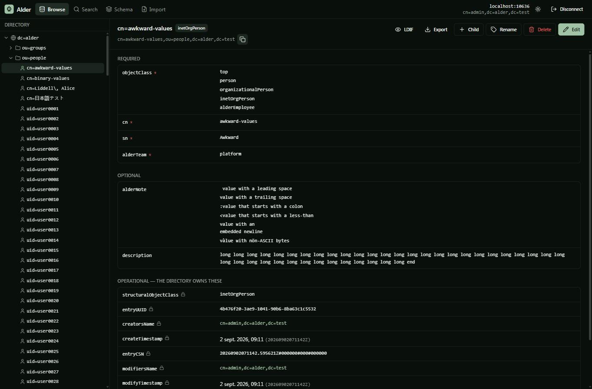
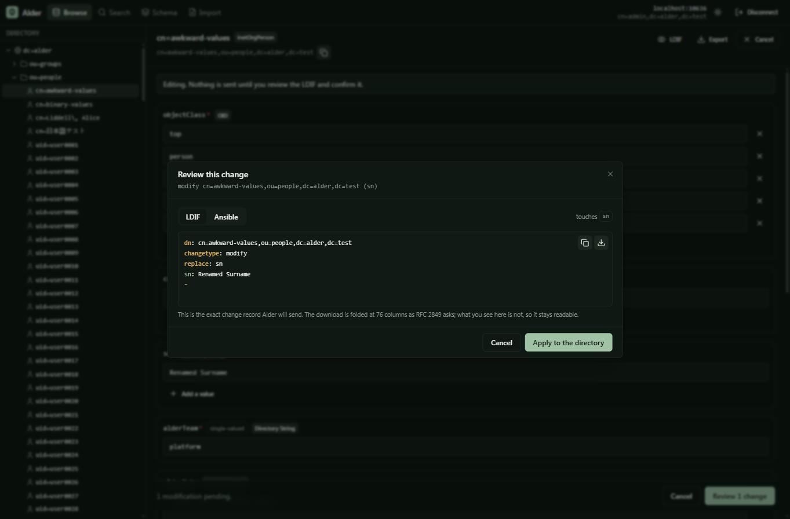
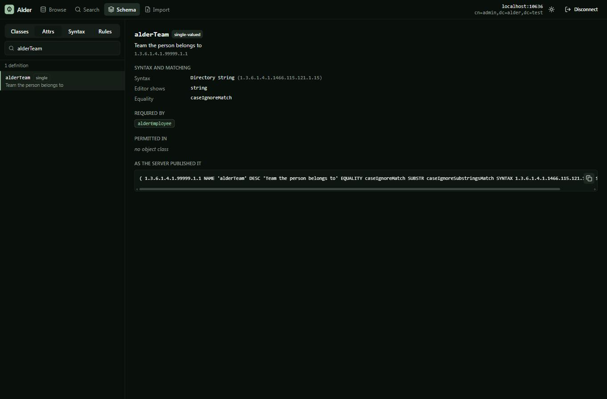

# Alder

A modern web UI for OpenLDAP and 389 Directory Server. Browse the schema, edit
entries safely, export every change as LDIF or Ansible.

> A directory engineering tool whose output is code.

Alder is for the platform engineer who owns a directory and currently manages it
with `ldapsearch`, hand-written LDIF, and a twenty-year-old PHP tool they do not
trust. Everything Alder does to a directory can be previewed as LDIF and
exported as an Ansible task. It is not a click-here-and-hope admin panel; it is
an authoring environment for directory changes, with a browser attached.

Alder wood hardens instead of rotting when submerged. Venice stands on alder
piles that have held for centuries. It seemed a fitting name for the directory
everything else authenticates against.

## Status

**Feature complete for v1.** Connect, browse, search, edit, import and export
all work, against both target servers.

| | |
|---|---|
| M0 | Repo, test harness, `dn` and `filter` packages, CI. **Done.** |
| M1 | Driver interface, LDAP driver, RootDSE capabilities, RFC 4512 schema parser, conformance suite. **Done.** |
| M2 | React UI: connect, browse the tree, view entries, browse the schema. **Done.** |
| M3 | Write path: `ChangeRecord`, LDIF preview with a mandatory confirm, schema-driven editor. **Done.** |
| M4 | LDIF import and export, Ansible export. **Done.** |
| M5 | Release: screenshots, GoReleaser, GHCR, security policy, automated versioning. **Done.** |
| 1.0 | Every item above shipping, with a stated compatibility promise. **Done.** |

An export can also be drawn as an **outline** — the same entries as the tree they
form, with what each one is and how much sits below it. It is deliberately not
LDIF and says so on its first line: LDIF reads a leading space as a continuation
of the line above, so a tree drawn with indentation could never also be a
document you import. It is for reading, and for pasting into a ticket.

[`docs/COMPATIBILITY.md`](docs/COMPATIBILITY.md) says what 1.x will and will not
change under you: the LDIF and Ansible an export produces are byte-stable, the
HTTP API only grows, and the web interface is deliberately not part of the
promise. [`docs/DECISIONS.md`](docs/DECISIONS.md) records the decisions behind
the design and why the alternatives were rejected. [`CONTRIBUTING.md`](CONTRIBUTING.md) has
the scope boundaries and the rules that are not style preferences.



*An entry from the test harness, chosen because every one of its values is
awkward: a leading space, a trailing space, one starting with a colon, one with
an embedded newline, one with non-ASCII bytes. Required attributes are marked,
the directory's own operational attributes are filed separately and locked, and
timestamps are rendered as dates.*

## Try it

```sh
task compose:up                        # OpenLDAP and 389 DS, seeded, with TLS
task build                             # SPA + binary
./bin/alder serve --addr 127.0.0.1:8443 --allow-http
```

Then open the address it prints and connect to `localhost:10636` (OpenLDAP,
`cn=admin,dc=alder,dc=test` / `alder-admin`) or `localhost:11636` (389 DS,
`cn=Directory Manager` / `alder-directory-manager`), pasting
`test/compose/certs/ca.crt` into the CA field.

Or with Docker:

```sh
docker build -t alder .
docker run --rm -p 8443:8443 alder serve --tls-cert /certs/tls.crt --tls-key /certs/tls.key
```

Alder refuses to start without TLS. It holds a directory bind password in memory
for the life of a browser session and will not carry it over a plaintext
connection by default; pass `--allow-http` if something in front of it is
terminating TLS.

## What it does

**Browse** the DIT as a lazy tree, one level per expansion. Entries render with
their attributes annotated from the schema: required attributes marked, the
directory's own operational attributes filed separately and read-only, DN values
as links, timestamps as dates, binary values as sizes rather than mojibake.

**Edit** through a form the schema builds. Single-valued attributes get no "add
value" button. `NO-USER-MODIFICATION` attributes are not editable. "Add an
attribute" offers exactly what the entry's object classes permit, and nothing
else. An attribute whose values are binary is shown but not editable as text.

**Confirm** every write. There is one code path that modifies a directory and it
opens this dialog first, showing the exact RFC 2849 change record that will be
sent — rendered by the server from the same `ChangeRecord` it will act on, so
the preview and the effect cannot drift apart. The same record renders as a
`community.general` Ansible task on the next tab.



If someone else changes the entry while you have it open, the editor says which
attributes drifted and that applying will overwrite them, rather than silently
discarding your work or silently clobbering theirs.

**Search** with a filter builder or a raw RFC 4515 filter. Filters are parsed,
never interpolated. Every search is paged and bounded, and a truncated result
says so.

Every search hands back the `ldapsearch` that runs it, for a runbook, a ticket
or a script. The server renders it, so the filter in it is the one the server
parsed and sent rather than the text in the box — normalising it is the whole
point of parsing it, and a command built from what was typed would describe a
different search from the results beside it. It reproduces what the session
actually did, down to `-ZZ` for StartTLS and an `LDAPTLS_REQCERT=never` where
verification was skipped. The password is not in it: `-W` prompts.

Searching for people and groups is most of what anyone does, so those are ready
made: tabs that run the filter for you and show the columns that matter for what
you asked about. The columns are yours to choose, from what the schema says the
matching entries can actually hold rather than from a fixed list — a directory's
own attributes are the interesting ones, and a fixed list never has them.
Choosing a column re-runs the search asking for it, because a column added to
rows already fetched shows a dash that reads as "there is no value" when it
means "nobody asked for one".

**See what names an entry** before you break it. Which groups is this account in,
what else points at it — the question asked most often about an account, and the
one to ask before deleting anything. The answer says which attribute each
referring entry uses, not merely that it refers, because they are not the same
thing to undo: one entry can hold the same person as a `member` and as an
`owner`, and removing either is a delete of one value of that one attribute on
the entry doing the naming. So each is offered separately, and each goes through
the usual preview.

The values are compared as the directory would compare them. A server may return
a reference spelled differently from the entry's own DN, and `uniqueMember`
carries an optional UID suffix that is not part of the DN at all; a reference
missed for either reason is a reference nobody is warned about.

**See who is in a group,** which is the same question from the other side and a
harder one than it looks. A member list answers it only while no member is
itself a group: `cn=everyone` in the test harness lists five members and
contains no people at all, because every one of the five is a group — and three
hundred people are in it. Expanding walks that structure and says, for each
person, the chain of groups that reached them, which is what you need in order
to remove somebody from the right group rather than the outermost one. A group
that contains itself, a member DN whose entry was deleted, and a `memberUid`
that holds a login name rather than a DN are each reported rather than dropped.

**Compare two entries** when one account works and another does not. Attribute
by attribute: what they share, what differs, what only one has. Each side is
annotated from its *own* object classes, which the two entries need not share —
so an attribute one entry's classes require and it does not hold shows up, and
that absence is often the whole answer while being invisible to any diff of
what is present. DNs are compared as DNs. Sensitive attributes are compared on
presence alone: that a password is set is not a secret, but whether two entries
hold the same one is not a question this answers.

**Tally what an attribute actually holds** across a subtree — the query that
finds a team name spelled wrong with four people on it, a cost centre nobody
has used since a reorganisation, or the accounts still pointing at a
decommissioned site. It is a tally over a bounded search, so every number is
scoped to the entries examined and says so; a tally that quietly summarises a
truncated result set is not a weaker answer than the truth, it is a confident
wrong one. Values held by exactly one entry are called out, because that is
usually where the typo is. Sensitive attributes are refused before the search
runs rather than filtered out of the result.

**Jump to anything from the keyboard.** Ctrl+K takes a DN and opens it, an RFC
4515 filter and runs it, or a name and looks for it. The server does the
parsing, because `internal/dn` and `internal/filter` are the authorities on what
those strings are and a pattern in the browser would drift from them. It never
guesses: `cn=platform` is a valid one-component DN *and* almost certainly a
request to find something called platform, so both are offered and you pick.

**Browse the schema** — object classes, attribute types, syntaxes and matching
rules, fully cross-linked. A class shows what it requires and permits, split
between its own and its inherited attributes, and every one is a link. An
attribute shows the classes that require and permit it, its syntax, and the
definition exactly as the server published it. Definitions the parser could not
read are listed rather than hidden.



**Stage a changeset.** Every confirmation dialog can queue its change instead of
applying it. A staged set is read as one LDIF document and exported as one
Ansible playbook, reordered by hand, and applied in order. Alder points out what
no single change can see — an entry created before its parent, an entry acted on
after being deleted, the same entry changed twice — and reorders nothing on its
own, because a move under something created later is a legitimate thing to want.

A run stops at the first refusal and reports what landed and what was not
attempted; LDAP has no transaction across entries, so nothing is rolled back and
Alder does not pretend otherwise. What did not apply stays staged, in order, so
correcting one change and applying again resumes rather than repeats.

**Browse the server's own configuration.** A directory keeps its configuration
in the directory, and that tree appears in the browser beside the data whenever
the session can read it — the databases, the access rules, the schema. The DN is
taken from what the server announces, and otherwise found by trying the
conventional location and believing only what the server answers.

The account that administers a suffix usually has no rights in the
configuration, so the connection screen takes an optional second identity for
it. Requests are routed by DN: one session browses people as the directory
administrator and the configuration as the configuration administrator, and
neither borrows the other's rights. Without it, reaching the configuration would
mean connecting as the configuration administrator and giving up the data.

**Edit the configuration, carefully.** Configuration entries are ordinary
entries, so the same editor and the same LDIF preview work on them. Changing
them is not ordinary, so a change addressed into the configuration tree says so,
and a change touching something you can lock yourself out with — access rules,
the administrative identity, the ports the server listens on — says which and
why. Nothing blocks; the directory decides, and you are the one who asked.

Where a server keeps its schema in the subschema subentry rather than in
configuration entries, that entry is a root of its own. It sits outside every
naming context, so it appears under nothing else — which made it the one part of
such a directory the tree could not reach.

**Edit the schema.** Object classes and attribute types can be added, changed
and removed, through a form or by writing an RFC 4512 definition out by hand —
either way it is parsed and checked before anything is sent.

A schema definition is a value of an attribute on an ordinary entry, so a schema
change is an ordinary modify, and it goes through the same confirmation, the
same LDIF preview, the same Ansible export and the same changeset as every other
write. There is still exactly one code path that writes to a directory.

Where the schema is kept differs, and Alder reads that from the server rather
than from its name. A server that announces a configuration tree generates its
subschema subentry from configuration entries, so a definition is written to one
of those — and Alder asks which, because they load in order and the first is the
server's core schema. A server that announces none has a subschema subentry that
is the schema, and takes the change directly.

The value a change removes is read back from the entry that holds it, never from
what the schema browser displays. The two differ: a server keeping its schema in
configuration prefixes each stored definition with its load order and strips
that prefix from what it publishes, and 389 DS records `X-ORIGIN 'user defined'`
on anything added at runtime. A change built from the displayed form would match
nothing on a removal and leave two definitions of one OID on an edit.

**Import and export.** Export an entry, a subtree, or what a search is
showing — the table's filter goes to the exporter, because "the thirty people I
just searched for" is the thing that actually goes in a ticket, and it used to be
assembled by hand. The entries come out whole rather than cut down to the
displayed columns: a partial entry is not something you can put back. A filtered
export says so in the file's header, since a file that does not describes
something narrower than its base and reads later as the whole of it.

The same thing exports as an Ansible playbook that *enforces* it rather than one
that merely creates what is missing. `ldap_entry` with `state: present` asserts
an entry exists and stops there — run it against an entry holding entirely
different attributes and it reports success and changes nothing — so each entry
gets a create task and an `ldap_attrs` task with `state: exact`, ordered parent
first because nothing can create a child under a parent that does not exist yet.
Attributes the directory owns are left out, since a task enforcing one fails on
every run, and sensitive ones are left out with no way to include them: a
playbook is a file destined for a repository.

Import a document and apply its records one at a time, each through the same
confirmation, or stage the whole parsed document into the changeset and review it
as one thing. A file of forty records is a decision about forty records, and
confirming them one by one is not the same review.

That closes the loop the export half opens: export a subtree, correct what is
wrong in the file, import it back. An exported record has no `changetype`, so it
is an add, and a directory refuses an add for an entry that exists — so import
can be told to update entries that are already there, turning such a record into
a modification instead.

It replaces the attributes the record names and leaves every other attribute
exactly as it is. An export omits `userPassword` always and operational
attributes by default, and a file that does not mention an attribute is not a
file asking for it to be removed. A document that has not been edited produces
no changes at all rather than a page of modifications that do nothing, and the
entries that already match are listed so you can see the import understood them.

**Delete a container** by staging what is under it. LDAP deletes one leaf at a
time, so removing an organisational unit means removing everything below it
first, deepest first, in order. Alder walks the subtree, stages the deletions in
that order, and hands you the list to review as one changeset — rather than
refusing because the entry has children, which is what it used to do while
offering no way to do the thing it was suggesting.

## Two servers, one behaviour

OpenLDAP and 389 Directory Server are both first-class, and that is enforced by
one table-driven conformance suite that runs every case against both:

```sh
task test:conformance:up
```

Nothing in Alder branches on the vendor. The RootDSE is read once at connect
time into a `Capabilities` value and behaviour follows from that. It is why the
same code finds the schema at `cn=Subschema` on OpenLDAP and `cn=schema` on
389 DS without knowing which is which.

## Security posture

- Bind credentials live in server memory keyed by an httpOnly, Secure,
  SameSite=Strict cookie. Not on disk, not in a JWT, not in `localStorage`.
  Restarting the server logs everyone out.
- Sensitive attributes (`userPassword` and friends) are never sent to the
  browser and never logged. The UI reports them as set, with a count.
- LDIF exports omit them too, unless explicitly asked for.
- `attr:< url` references in imported LDIF are refused. Following one from a
  process holding a privileged bind would be file disclosure via `file://` and
  request forgery via `http://`.
- Filters are parsed and re-escaped; DNs are parsed and re-rendered. Neither is
  ever built by string concatenation.
- TLS is on by default in both directions.

## Working on it

```sh
task                 # every task
task check           # vet, lint, test: what CI runs
task compose:up       # two directory servers, seeded, with TLS
task test:conformance
task generate        # regenerate the API types after editing api/openapi.yaml
task dev             # prints the two commands for hot-reloading the SPA
```

You need Go 1.25 or newer, Node 22 or newer, and Docker. See
`test/compose/README.md` for what the harness gives you.

`api/openapi.yaml` is the source of truth for the HTTP API. The Go server
interface and the TypeScript client are both generated from it.

## Layout

| Package | |
|---|---|
| `internal/dn` | RFC 4514 distinguished names. DNs are never strings; there is no exported way to build one by concatenating text. |
| `internal/filter` | RFC 4515 search filters, built and parsed. Values are escaped and a raw filter typed by a user is parsed rather than passed through. |
| `internal/schema` | RFC 4512 schema: parser, index, and the presentation opinion that drives the editor. |
| `internal/ldif` | RFC 2849 reader and writer. Values are `[]byte` throughout. |
| `internal/directory` | The `Driver` and `Session` interfaces, `Capabilities`, and `ChangeRecord`. |
| `internal/directory/ldapdriver` | The only driver in v1. |
| `internal/ansible` | `ChangeRecord` to a `community.general` task. |
| `internal/api` | The generated server interface and the handlers behind it. |
| `internal/session` | In-memory session store. |
| `internal/web` | The embedded SPA. |
| `web/` | The React application. |
| `test/compose` | OpenLDAP and 389 DS, TLS from one CA, 320 identical entries each. |
| `test/conformance` | One suite, both servers, identical assertions. |

## Licence

[GNU Affero General Public License v3.0](LICENSE).

The AGPL is deliberate rather than incidental. Alder is a tool you run as a
service, and section 13 is the clause that matters: if you modify Alder and let
other people use it over a network, you have to offer them your modified
source. That keeps the conformance harness — the expensive part, and the thing
that makes "works on both servers" true rather than aspirational — from being
absorbed into something closed.

Using Alder to administer your directory imposes nothing on you. Your
directory's data is yours, the LDIF and Ansible it generates are yours, and
running it internally is not distribution. The obligation attaches only if you
modify Alder itself and offer that modified version to others.

Alder serves its own source offer at `/api/v1/source`, which is what section 13
asks for. If you deploy a modified build, point `--source-url` at your fork.

Contributions are covered by a [Contributor Licence Agreement](CLA.md), which
keeps the option of licensing Alder on other terms open. Contributors keep the
copyright in their work.
